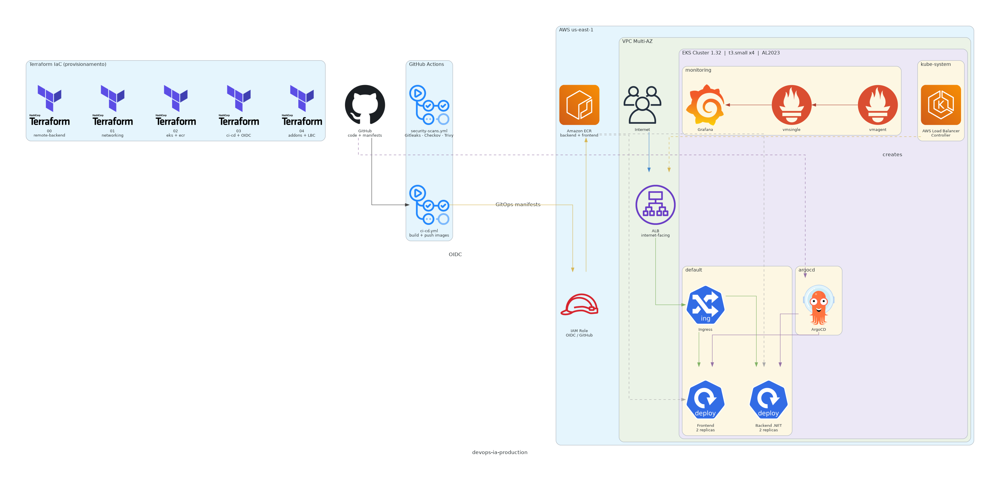

# AWS DevOps Platform: EKS + Terraform + GitOps + Observabilidade

Projeto de portfólio que sobe uma plataforma DevOps completa na AWS usando práticas que se aproximam do que se faz em ambientes reais: infraestrutura como código com Terraform, pipeline CI/CD autenticado via OIDC sem credenciais fixas, entrega contínua via GitOps com ArgoCD e observabilidade com VictoriaMetrics e Grafana.

O projeto tem dois serviços de exemplo, uma API .NET e um frontend Next.js, mas o foco é a plataforma em si: como as peças se conectam, por que cada ferramenta foi escolhida e como tudo funciona junto.



## Estrutura do repositório

```
devops-ia-terraform/         Stacks Terraform (uma por camada de infra)
  00-remote-backend-stack-ai   S3 para o state remoto
  01-networking-stack-ai       VPC, subnets, NAT Gateway, Flow Logs
  02-eks-stack-ai              EKS, Node Group, addons (CoreDNS, kube-proxy, VPC CNI), ECR
  03-ci-cd-stack-ai            OIDC Provider + IAM Role para o GitHub Actions
  04-addons-stack-ai           Metrics Server + AWS Load Balancer Controller (Helm + IRSA)

devops-ia-kubernetes/        Manifestos Kubernetes (gerenciados pelo ArgoCD via kustomize)
  backend/                     Deployment, Service (ClusterIP), PodDisruptionBudget
  frontend/                    Deployment, Service (ClusterIP), PodDisruptionBudget
  ingress.yaml                 ALB Ingress: / -> frontend, /backend -> backend
  monitoring/                  Helm values do VictoriaMetrics k8s stack
  kustomization.yaml           Base do GitOps: referencia recursos e sobrescreve tags de imagem
  argocd-application.yaml      ArgoCD Application (aplicado uma vez no bootstrap)

devops-ia-apps/              Código-fonte das aplicações
  backend/                     API .NET com Dockerfile multi-stage
  frontend/                    Next.js com Dockerfile multi-stage

.github/workflows/           GitHub Actions
  ci-cd.yml                    Build e push de imagens, atualização de tags no kustomize
  security-scans.yml           Gitleaks + Checkov em cada push
  security-scheduled.yml       Mesmos scans rodando diariamente por agendamento

docs/                        ADRs e registros de implementação
```

## Infraestrutura como código

Cada stack Terraform é um diretório independente com seu próprio state remoto no S3. Elas são aplicadas em sequência porque dependem umas das outras via `terraform_remote_state`.

A stack `00-remote-backend-stack-ai` cria o bucket S3 e a tabela DynamoDB para lock. As demais stacks apontam para esse backend. Não existe `terraform.tfvars` no repositório, os valores ficam em `envs/production.tfvars` dentro de cada stack.

Quando o projeto foi criado, o backend do S3 existia, mas os arquivos `versions.tf` de algumas stacks ainda tinham o placeholder `<YOUR_ACCOUNT_ID>` no endereço do bucket. Esse tipo de detalhe é fácil de passar despercebido, e foi uma das primeiras correções necessárias quando o projeto foi retomado.

## Configuração do cluster

O cluster se chama `devops-ia-production` e fica na região `us-east-1`. Usa EKS 1.32 com um Managed Node Group de instâncias `t3.small` (2 GiB RAM cada), AMI `AL2023_x86_64_STANDARD`.

O cluster roda com 4 nodes distribuídos em três zonas de disponibilidade (`us-east-1a`, `us-east-1b`, `us-east-1c`). O mínimo configurado é 1 node, máximo 4 e o desired atual é 3 no tfvars (mas 4 estão rodando na AWS após um scaling manual que ficou fora do Terraform, ver seção de problemas).

A VPC tem subnets públicas e privadas em três AZs, NAT Gateway e Flow Logs habilitados. Os nodes ficam nas subnets privadas e o plano de controle do EKS é gerenciado pela AWS.

O VPC CNI do EKS limita os IPs disponíveis por node. Em `t3.small` o limite é de 9 IPs para pods (3 ENIs com 4 IPs secundários cada, menos os 3 IPs primários usados pela ENI). Para aumentar esse limite sem trocar de instância, a configuração do kubelet via `nodeadm` define `maxPods: 110`, o que depende de prefix delegation no CNI para funcionar. Isso está documentado no `ADR-0003`.

## CI/CD

O repositório tem três workflows no `.github/workflows/`.

### `ci-cd.yml` — build e entrega contínua

Roda em todo push para `main` que altere arquivos em `devops-ia-apps/`. Só constrói o que mudou — se só o backend mudou, o frontend não é reconstruído.

| Job | O que faz |
|---|---|
| **detect-changes** | Usa `paths` filter para identificar quais apps mudaram e setar flags (`backend-changed`, `frontend-changed`) que os jobs seguintes consultam via `needs` |
| **build-backend** | Login no ECR via OIDC (sem credenciais fixas), `docker build` da API .NET, `docker push` para o ECR com tag `sha-<commit>` |
| **build-frontend** | Mesma sequência para o Next.js |
| **update-kustomization** | Atualiza as tags de imagem no `devops-ia-kubernetes/kustomization.yaml` e faz um commit de volta no repositório. Esse commit dispara o ArgoCD a sincronizar o cluster. |

A autenticação usa OIDC: o Actions assume uma IAM Role via `AssumeRoleWithWebIdentity` sem nenhuma chave de acesso armazenada. A trust policy da role restringe o acesso a tokens gerados especificamente por este repositório.

### `security-scans.yml` — scans em todo push e PR

Roda em paralelo com o CI/CD em todo push para `main` e em qualquer PR aberto contra `main`. Todos os jobs fazem upload de resultados no formato SARIF para o GitHub Code Scanning (aba Security do repositório).

| Job | Ferramenta | O que verifica | Critério de bloqueio |
|---|---|---|---|
| **Secret Scan (Gitleaks)** | Gitleaks | Varre todo o histórico de commits buscando tokens, chaves e senhas expostos acidentalmente | Qualquer achado bloqueia |
| **Terraform IaC Scan (Checkov)** | Checkov | Analisa os arquivos `.tf` buscando má configuração: buckets S3 sem criptografia, security groups abertos, logs desabilitados, etc. | CRITICAL bloqueia |
| **Kubernetes IaC Scan (Checkov)** | Checkov | Analisa os manifestos Kubernetes: containers rodando como root, sem `readOnlyRootFilesystem`, sem resource limits, sem liveness probe, etc. | CRITICAL bloqueia |
| **Frontend SAST (Semgrep)** | Semgrep | Análise estática do código TypeScript/Next.js com regras OWASP Top 10 e padrões de segurança para TypeScript | Findings viram anotações no PR |
| **Backend SAST (Semgrep)** | Semgrep | Mesma análise para o código C#/.NET com ruleset OWASP Top 10 e C# específico | Findings viram anotações no PR |
| **Frontend SCA (npm audit + Trivy)** | npm audit + Trivy | Verifica vulnerabilidades nas dependências npm. Trivy também escaneia o filesystem por segredos e arquivos de configuração inseguros | CRITICAL bloqueia, HIGH gera warning (SLA 7 dias) |
| **Backend SCA (.NET audit + Trivy)** | dotnet list + Trivy | Mesma verificação para pacotes NuGet | CRITICAL bloqueia, HIGH gera warning |
| **Frontend Container Scan (Trivy)** | Trivy | Constrói a imagem Docker do frontend e escaneia camadas, pacotes OS e bibliotecas da imagem final | CRITICAL bloqueia o merge |
| **Backend Container Scan (Trivy)** | Trivy | Mesma coisa para a imagem do backend | CRITICAL bloqueia o merge |
| **Security Scan Summary** | — | Job final que consolida o resultado de todos os jobs no GitHub Step Summary da execução | Sempre roda (`if: always()`) |

### `security-scheduled.yml` — varredura diária

Roda todo dia às 06:00 UTC independente de haver novos commits. O objetivo é detectar CVEs publicados após o último commit (drift de vulnerabilidade): uma dependência pode estar segura hoje e ter uma CVE descoberta amanhã sem que ninguém faça push.

| Job | O que faz |
|---|---|
| **Secret Scan (Gitleaks)** | Mesma varredura de segredos, rodando no estado atual do `main` |
| **Full Repository Scan (Trivy)** | Trivy escaneia todo o repositório (`scan-ref: .`) por vulnerabilidades, segredos e configurações inseguras |
| **Terraform IaC Scan (Checkov)** | Mesma análise do código Terraform, com `soft_fail: true` para não bloquear (é um scan de auditoria, não de gate) |
| **Scheduled Scan Summary** | Consolida os resultados com timestamp no Step Summary |

## Observabilidade

O monitoramento usa a stack **VictoriaMetrics k8s stack** instalada via Helm no namespace `monitoring`. A escolha foi pelo VictoriaMetrics ao invés do kube-prometheus-stack por ser mais leve em memória, o que faz diferença em nodes `t3.small`.

Os componentes rodando são:

- `vmsingle`: armazena as métricas. Neste ambiente usa um PersistentVolume do tipo `hostPath` porque o cluster não tem o EBS CSI Driver instalado. Isso significa que se o pod for reagendado para um node diferente, o histórico de métricas é perdido. Em produção usaria EBS via CSI Driver.
- `vmagent`: faz o scraping de métricas do cluster (pods, nodes, kube-state-metrics) e envia para o vmsingle.
- `grafana`: dashboards. Roda com memória limitada a 512 MiB porque o Grafana 13 não sobe com menos que isso em `t3.small` (entrava em OOMKilled com 384 MiB).
- `kube-state-metrics`: expõe métricas sobre o estado dos objetos Kubernetes (deployments, pods, nodes).
- `prometheus-node-exporter`: expõe métricas de hardware e sistema operacional dos nodes.

O datasource do Grafana aponta para o vmsingle usando o tipo prometheus (compatível). O plugin nativo do VictoriaMetrics `victoriametrics-metrics-datasource` está instalado mas não configurado como datasource porque causou erros ao tentar instalar via ConfigMap pré-provisionado do chart.

## Ingress com AWS Load Balancer Controller

A stack `04-addons-stack-ai` instala o **AWS Load Balancer Controller** via Helm com autenticação IRSA (IAM Role for Service Account). O controller cria um Application Load Balancer real na AWS a partir do `Ingress` definido em `devops-ia-kubernetes/ingress.yaml`.

O roteamento é baseado em path:

- `/*` vai para o frontend (porta 3000)
- `/backend/*` vai para o backend (porta 8080)

Os serviços de frontend e backend usam `type: ClusterIP` porque o ALB roteia diretamente para os IPs dos pods via `target-type: ip`, sem passar pelo NodePort. As subnets públicas têm a tag `kubernetes.io/role/elb = "1"` para que o controller consiga fazer a auto-descoberta e associar o ALB às subnets corretas.

O ALB é criado automaticamente pelo controller quando o `Ingress` é aplicado pelo ArgoCD. Para pegar o DNS do ALB:

```bash
kubectl get ingress -n default
```

## Como acessar os serviços

### Via ALB (acesso externo)

Após o ArgoCD sincronizar o `Ingress`, o ALB fica disponível pelo DNS que o controller atribui:

```bash
kubectl get ingress devops-ia-ingress -o jsonpath='{.status.loadBalancer.ingress[0].hostname}'
```

| Caminho | Serviço |
|---|---|
| `http://<alb-dns>/` | Frontend |
| `http://<alb-dns>/backend/swagger` | Backend Swagger |

### Via port-forward (acesso local)

Para acessar Grafana e ArgoCD, use o script na raiz do projeto:

```bash
bash port-forward.sh
```

Ele inicia port-forwards para todos os serviços com loop de auto-reconexão (se um pod reiniciar, o forward retoma automaticamente depois de 2 segundos):

| Serviço | Endereço local | Credenciais |
|---|---|---|
| Frontend | http://localhost:3000 | |
| Backend (Swagger) | http://localhost:8080/backend/swagger | |
| Grafana | http://localhost:3001 | admin / devops-ia-2026 |
| ArgoCD | https://localhost:8443 | admin / (ver secret no cluster) |

## Do zero ao ar

### Pré-requisitos

- AWS CLI configurada com permissões para criar VPC, EKS, IAM, S3, ECR
- Terraform instalado
- kubectl instalado

### 1. Backend remoto

```bash
cd devops-ia-terraform/00-remote-backend-stack-ai
terraform init
terraform apply -var-file="envs/production.tfvars"
```

### 2. Rede

```bash
cd devops-ia-terraform/01-networking-stack-ai
terraform init
terraform apply -var-file="envs/production.tfvars"
```

### 3. EKS e ECR

```bash
cd devops-ia-terraform/02-eks-stack-ai
terraform init
terraform apply -var-file="envs/production.tfvars"
```

Depois do apply, configure o kubectl:

```bash
aws eks update-kubeconfig --name devops-ia-production --region us-east-1
kubectl get nodes
```

### 4. OIDC e IAM para o CI

```bash
cd devops-ia-terraform/03-ci-cd-stack-ai
terraform init
terraform apply -var-file="envs/production.tfvars"
```

No GitHub, crie a variável de repositório `AWS_ROLE_ARN` com o ARN da role que o output do Terraform retornar.

### 5. Addons: Metrics Server e AWS Load Balancer Controller

```bash
cd devops-ia-terraform/04-addons-stack-ai
terraform init
terraform apply -var-file="envs/production.tfvars"
```

Isso instala o Metrics Server (necessário para `kubectl top` e HPA) e o AWS Load Balancer Controller. O controller precisa de uma IAM Role com IRSA — o Terraform cria a role e o Helm chart já configura o ServiceAccount com a anotação correta.

Após o apply, confirme que o controller está rodando:

```bash
kubectl get pods -n kube-system -l app.kubernetes.io/name=aws-load-balancer-controller
```

### 6. ArgoCD

O ArgoCD não está no kustomize para evitar que ele gerencie a si mesmo. É instalado uma única vez via bootstrap:

```bash
kubectl create namespace argocd
kubectl apply -n argocd -f \
  https://raw.githubusercontent.com/argoproj/argo-cd/v2.14.11/manifests/install.yaml

kubectl wait --for=condition=Ready pods --all -n argocd --timeout=300s

kubectl apply -f devops-ia-kubernetes/argocd-application.yaml
```

A senha inicial do admin está no secret `argocd-initial-admin-secret`. Após o bootstrap, o ArgoCD sincroniza o repositório automaticamente e sobe as aplicações.

### 7. Monitoramento

O VictoriaMetrics é instalado pelo próprio ArgoCD via Helm, mas o PersistentVolume precisa ser criado manualmente porque não há EBS CSI Driver no cluster:

```bash
kubectl apply -f - <<EOF
apiVersion: v1
kind: PersistentVolume
metadata:
  name: vmsingle-hostpath
spec:
  capacity:
    storage: 5Gi
  accessModes:
    - ReadWriteOnce
  hostPath:
    path: /tmp/vmsingle-data
  claimRef:
    namespace: monitoring
    name: vmsingle-victoria-metrics-victoria-metrics-k8s-stack
EOF
```

## Problemas que encontramos durante o projeto

Este projeto não foi uma instalação limpa do zero. Surgiram vários problemas que vale documentar porque mostram situações reais que acontecem em clusters EKS.

**Esgotamento de IPs no VPC CNI (t3.small)**

O maior problema recorrente foi o VPC CNI ficar sem IPs disponíveis em um node. O `t3.small` tem limite de 9 IPs para pods, e quando ArgoCD, kube-system e os serviços da aplicação se concentram no mesmo node, esse limite é atingido. O sintoma é pod ficando em `ContainerCreating` com evento `failed to assign an IP address to container`.

A solução imediata é fazer `cordon` no node saturado, deletar os pods travados para que sejam reagendados em outros nodes, e depois `uncordon`. Isso está documentado em detalhe na skill `/depoveiro`.

**Scaling event causando dezenas de pods Pending**

Quando o cluster foi escalado de 2 para 4 nodes, os novos nodes entraram mas o VPC CNI ainda estava inicializando o pool de IPs. O scheduler agendou uma dezena de pods em dois dos nodes antes deles estarem prontos para atribuir IPs, e todos ficaram `Pending`. A solução foi a mesma: cordon dos nodes saturados, delete em massa dos pods Pending, uncordon. Isso ficou documentado como Padrão E na skill `/depoveiro`.

**Rolling update do node group travado por PDB**

Ao tentar mudar `desired_size` de 2 para 3 via Terraform ao mesmo tempo que outra propriedade do Launch Template, o Terraform iniciou um rolling update completo. O rolling update precisava drenar um node, mas os dois pods de backend estavam no mesmo node, e o PodDisruptionBudget com `minAvailable: 1` bloqueava a drenagem porque remover qualquer dos dois pods deixaria zero running.

A saída foi usar `aws eks update-nodegroup-config` diretamente para só aumentar o scaling sem substituir os nodes, que não dispara rolling update.

**Grafana com OOMKilled**

O Grafana 13 não ficava estável com 384 MiB de limite de memória. Depois de alguns minutos recebia OOMKilled. Aumentar para 512 MiB resolveu. Isso foi ajustado nos `values.yaml` do chart.

**Datasource do VictoriaMetrics não carregando**

A stack VictoriaMetrics k8s configura dois datasources no Grafana via ConfigMap. Um deles usa o tipo `victoriametrics-metrics-datasource`, um plugin não assinado que precisa de permissão explícita no `grafana.ini`. O plugin estava instalado mas a configuração de `allow_loading_unsigned_plugins` não estava sendo aplicada corretamente via Helm. A solução foi remover a entrada com o tipo proprietário do ConfigMap e usar apenas o datasource com tipo `prometheus`, que é compatível com o VictoriaMetrics.

**Placeholder `<YOUR_ACCOUNT_ID>` no código**

O repositório foi inicialmente gerado com placeholders que precisavam ser substituídos pelo ID real da conta AWS. Algumas stacks Terraform tinham esse placeholder no endereço do bucket S3 do backend, o que causava erros na inicialização do Terraform até ser corrigido.

## Skills do Claude Code para este projeto

Dois skills estão disponíveis para ajudar a operar este ambiente quando usado com o Claude Code:

`/depoveiro` verifica o estado do cluster e diagnostica os problemas conhecidos desta infraestrutura: pods em CrashLoopBackOff, ImagePullBackOff, esgotamento de IPs no CNI, rolling updates travados e ArgoCD fora de sync. Use quando perceber que algo está errado no cluster ou quiser confirmar que tudo está saudável.

`/PlantonistaOps` é o runbook de plantão. Cobre incidentes operacionais como S3 state lock travado, state Terraform vazio após apply interrompido, node group com NodeCreationFailure por AMI deprecada (AL2 foi descontinuada em novembro de 2025), ASG preso no destroy, kubeconfig com credenciais inválidas após recreate do cluster e ArgoCD com dex-server crashando por `server.secretkey is missing`. Use quando o Terraform ou a infra não estiver se comportando como esperado.

## Como seria em produção

Este ambiente usa várias simplificações que não seriam aceitáveis em produção. As principais diferenças:

Os nodes `t3.small` são suficientes para laboratório, mas em produção a escolha de instância seria guiada pelo perfil de carga dos workloads. Para aplicações Java ou ML o mínimo seria `m5.large` ou `m5.xlarge`. Node groups separados por tipo de workload (nodes de sistema vs. nodes de aplicação) evitam que pods de kube-system e de aplicação compitam por recursos no mesmo node.

O PersistentVolume do VictoriaMetrics usa `hostPath`, o que significa que os dados são perdidos se o pod for reagendado. Em produção se usaria EBS via EBS CSI Driver, que o EKS instala como addon: `aws_eks_addon` com `addon_name = "aws-ebs-csi-driver"` e a role do node precisa ter a policy `AmazonEBSCSIDriverPolicy` anexada.

O cluster não tem Cluster Autoscaler ou Karpenter. Em produção o Karpenter seria a escolha: ele provisiona nodes em segundos baseado nas demandas dos pods, seleciona o tipo de instância mais eficiente para cada carga e elimina o overhead de gerenciar node groups manualmente.

Secrets e configurações sensíveis estão em valores fixos no repositório (passwords do Grafana e ArgoCD). Em produção usaria AWS Secrets Manager ou SSM Parameter Store com External Secrets Operator para injetar os valores nos pods sem que fiquem expostos em manifests ou values.yaml.

A retenção de métricas está configurada para 7 dias por limitação de armazenamento. Em produção 30 dias seria o mínimo para diagnóstico de incidentes, e dependendo da regulamentação poderia ser necessário reter por mais tempo.

## Decisões de arquitetura

Cada decisão relevante tem um ADR (Architecture Decision Record) em `docs/`:

| ADR | Assunto |
|---|---|
| ADR-0001 | VPC multi-AZ com subnets públicas e privadas |
| ADR-0002 | Backend remoto S3 para o state do Terraform |
| ADR-0003 | Cluster EKS e configuração do node group |
| ADR-0004 | OIDC Provider e IAM Role para GitHub Actions |
| ADR-0005 | Pipeline CI/CD com GitHub Actions |
| ADR-0006 | ArgoCD e padrão GitOps |
| ADR-0007 | Observabilidade com VictoriaMetrics e Grafana |
| ADR-0009 | Segurança no pipeline com scans automatizados |
| ADR-0010 | Estratégia de rollback e recovery |
| ADR-0011 | Ingress com AWS Load Balancer Controller e IRSA |

## Arquitetura

O diagrama no topo deste README é gerado com a biblioteca [diagrams](https://diagrams.mingrammer.com/). Para regenerar:

```bash
python3 docs/architecture/generate_diagram.py
```

Versões alternativas também disponíveis: `architecture.drawio` (draw.io) e `architecture.mmd` (Mermaid).

### Como funciona o fluxo

O desenvolvedor faz push para o repositório. O GitHub Actions detecta quais aplicações mudaram, constrói as imagens Docker e publica no ECR. Para autenticar na AWS, o Actions assume uma IAM Role via OIDC sem nenhuma credencial armazenada. Após o push, o pipeline faz um commit atualizando as tags de imagem no `kustomization.yaml`.

O ArgoCD monitora o repositório a cada 3 minutos. Quando detecta uma mudança no `kustomization.yaml`, aplica os manifestos no cluster via Kubernetes API. Os pods recebem as novas imagens diretamente do ECR, e o Deployment executa um rolling update garantindo zero downtime.

O vmagent coleta métricas de todos os pods, nodes e objetos Kubernetes e envia para o vmsingle. O Grafana consulta o vmsingle e exibe os dashboards.

